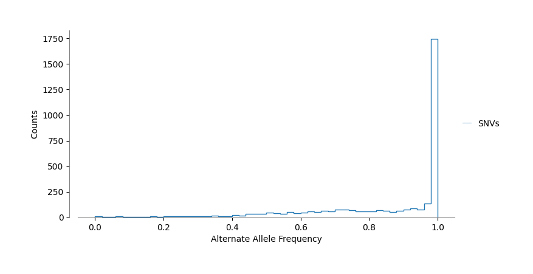

# Divergent Pathways: Tracking Cryptosporidium’s Host Adaptation


<!-- WARNING: THIS FILE WAS AUTOGENERATED! DO NOT EDIT! -->

## The Origin: Strain M4

Our journey begins with a single infected mouse (M4), harboring a
Cryptosporidium strain that would become the progenitor of two distinct
evolutionary paths. This initial host served as the critical branching
point for our experimental design.

From this single origin, the parasite’s story split into two parallel
narratives:

### 🐭 The Murine Passage 🐭

> In this pathway, Cryptosporidium continued its journey through a
> series of mouse hosts, adapting to the murine environment through
> sequential passages:

    M4 → M5 → M6 → M7

Each passage potentially allowed the parasite to optimize its survival
and reproductive strategies within these genetically similar mammalian
hosts.

### 🐄 The Bovine Passage 🐄

> Simultaneously, we challenged the adaptability of the same initial
> strain by introducing it to an entirely different mammalian lineage -
> neonatal calves:

    M4 → C1 → C2 → C3

This cross-species transmission forced the parasite to navigate a
dramatically different physiological environment, potentially driving
rapid adaptation.

## 🧬 Specialized Variant Calling Strategy 🧬

The progenitor Cryptosporidium population in mouse M4 wasn’t a
homogeneous colony, but rather a **diverse mixture of strains**.

> This discovery fundamentally shaped our analytical approach.

To capture the true genetic complexity within our samples, we
implemented a customized variant calling pipeline:

    ┌────────────────────────────────┐
    │ FREEBAYES VARIANT CALLING      │
    ├────────────────────────────────┤
    │ • Ploidy = 1                   │
    │ • --pooled-continuous option   │
    └────────────────────────────────┘

Why This Approach Matters?

1.  **Beyond Binary Detection**: \> Traditional presence/absence variant
    calling would have flattened the rich complexity of our samples,
    obscuring the very phenomenon we aimed to study.

2.  **Quantitative Insight**: \> By focusing on allele frequencies
    rather than simple variant calls, will allow us to track subtle
    shifts in population genetics across hosts.

# Variant Analysis: Filtering Strategy

Our approach employed a strategic sequence of filtering steps, each
addressing specific aspects of data quality:

    ┌─────────────────────────────────────┐
    │ THREE-TIER FILTERING STRATEGY       │
    ├─────────────────────────────────────┤
    │ 1. Quality-based Filtering          │
    │ 2. Read Depth Optimization          │
    │ 3. Variant Type Selection           │
    └─────────────────────────────────────┘

``` python
filter_variants()
```

    ======================================
    Starting Variant Filtering Process
    ======================================
    Total variants before filtering: 15901
    Stage 1: QUAL filtering: 14087 Variants removed and 1814 variants left
    Stage 2: FORMAT/DP filtering, DP >= 30 & DP <= 150: 355 Variants removed and 1459 variants left
    Stage 3: After keeping SNPs and indels: 203 Variants removed and 1256 variants left

### Stage 1: Quality-Based Filtering

``` bash
# Eliminate low confidence variant calls
bcftools filter -e 'QUAL < 30' "$INPUT_VCF" -o "$QUAL_FILTERED_VCF"
```

**Rationale**: The QUAL score represents the statistical confidence in
each variant call. By establishing a minimum threshold of 30: - We
eliminated variants likely to be sequencing errors - Retained variants
with a 99.9% probability of being genuine

### Stage 2: Read Depth Optimization

``` bash
# Balance between coverage requirements and anomalous amplification
bcftools view -i 'FMT/DP >= 30 & FMT/DP <= 150' "$QUAL_FILTERED_VCF" -o "$DP_FILTERED_VCF"
```

**Rationale**: Read depth optimization addressed two critical
concerns: - **Lower bound (DP ≥ 30)**: Ensured sufficient read
coverage - **Upper bound (DP ≤ 150)**: Protected against false positives
from regions with anomalous read pileups which often indicate repetitive
elements

### Stage 3: Variant Type Selection

``` bash
# Focus on  variation subset
bcftools view -v snps,indels "$DP_FILTERED_VCF" -o "$SNP_FILTERED_VCF"
```

**Rationale**: This final step ensured our analysis focused exclusively
on:

- Single nucleotide polymorphisms (SNPs)
- Small insertions and deletions (indels)

# From Raw Variants to Biological Insights 📊 with Pandas 🐼

Leveraging the robust capabilities of Python’s pandas library
transformed our genetic data into a powerhouse of actionable insights.

``` python
┌─────────────────────────────────────────────────────┐
│ DATA TRANSFORMATION PIPELINE                        │
├─────────────────────────────────────────────────────┤
│ 1. Load filtered VCF file                           │
│ 2. Remove ambiguous reference calls (REF = 'N')     │
│ 3. Restructure for for computing frequency          │
└─────────────────────────────────────────────────────┘
```

``` python
vcf_file = "../data/filtered_final.vcf"  
df_vcf = read_vcf(vcf_file)
print(f'step 1: {df_vcf.shape}')
df_vcf=df_vcf[(df_vcf['REF']!='N')]
print(f'step 2: {df_vcf.shape}')
```

    step 1: (1256, 16)
    step 2: (945, 16)

``` python
df_vcf.head()
```

<div>
<style scoped>
    .dataframe tbody tr th:only-of-type {
        vertical-align: middle;
    }
&#10;    .dataframe tbody tr th {
        vertical-align: top;
    }
&#10;    .dataframe thead th {
        text-align: right;
    }
</style>

|  | \#CHROM | POS | ID | REF | ALT | QUAL | FILTER | INFO | FORMAT | M7 | M5 | M4 | M6 | C3 | C2 | C1 |
|----|----|----|----|----|----|----|----|----|----|----|----|----|----|----|----|----|
| 0 | CM000429 | 60867 | . | TAAAAAAAAAAGATAT | TAAAAAAAAAAAGATTT,TAAAAAAAAAAAGATAT,TAAAAAAAAA... | 10088.400 | PASS | AB=0,0,0;ABP=0,0,0;AC=0,7,0;AF=0,1,0;AN=7;AO=1... | GT:GQ:DP:AD:RO:QR:AO:QA:GL | 2:138:82:9,2,67,2:9:296:2,67,2:24,2218,68:-172... | 2:138:46:3,2,35,1:3:100:2,35,1:24,1116,34:-91.... | 2:138:69:4,4,59,1:4:132:4,59,1:48,1980,34:-166... | 2:138:82:14,2,62,1:14:461:2,62,1:24,2092,26:-1... | 2:138:57:5,1,45,1:5:163:1,45,1:12,1492,34:-119... | 2:138:69:1,0,60,4:1:34:0,60,4:0,1966,136:-173.... | 2:138:62:4,1,50,4:4:130:1,50,4:12,1678,128:-13... |
| 1 | CM000429 | 60889 | . | ACCCCACT | ACCCCCACT | 11705.800 | PASS | AB=0;ABP=0;AC=7;AF=1;AN=7;AO=435;CIGAR=1M1I7M;... | GT:GQ:DP:AD:RO:QR:AO:QA:GL | 1:137:90:9,81:9:295:81:2686:-215.126,0 | 1:137:53:1,50:1:34:50:1596:-140.656,0 | 1:137:70:2,66:2:68:66:2184:-190.372,0 | 1:137:82:11,70:11:359:70:2241:-169.324,0 | 1:137:45:5,40:5:169:40:1237:-96.064,0 | 1:137:68:1,66:1:31:66:2174:-192.923,0 | 1:137:69:4,62:4:126:62:2002:-168.787,0 |
| 2 | CM000429 | 76625 | . | A | G | 265.872 | PASS | AB=0;ABP=0;AC=1;AF=0.142857;AN=7;AO=248;CIGAR=... | GT:GQ:DP:AD:RO:QR:AO:QA:GL | 0:131:104:76,28:76:2560:28:952:0,-144.672 | 0:131:80:52,28:52:1738:28:930:0,-72.6994 | 0:131:84:50,34:50:1596:34:1156:0,-39.5691 | 0:131:89:61,28:61:2066:28:944:0,-100.949 | 1:131:83:36,47:36:1216:47:1598:-34.3706,0 | 0:131:112:78,34:78:2630:34:1126:0,-135.322 | 0:131:112:63,49:63:2126:49:1658:0,-42.1062 |
| 3 | CM000429 | 82019 | . | A | T | 8192.190 | PASS | AB=0;ABP=0;AC=7;AF=1;AN=7;AO=410;CIGAR=1X;DP=5... | GT:GQ:DP:AD:RO:QR:AO:QA:GL | 1:160:98:9,89:9:306:89:2994:-241.841,0 | 1:160:51:15,36:15:510:36:1186:-60.8115,0 | 1:160:86:19,67:19:638:67:2240:-144.133,0 | 1:160:90:15,75:15:488:75:2488:-179.952,0 | 1:160:70:26,44:26:862:44:1472:-54.8869,0 | 1:160:81:31,50:31:1046:50:1662:-55.4182,0 | 1:160:71:22,49:22:748:49:1666:-82.5935,0 |
| 4 | CM000429 | 82192 | . | G | A | 6765.840 | PASS | AB=0;ABP=0;AC=6;AF=0.857143;AN=7;AO=398;CIGAR=... | GT:GQ:DP:AD:RO:QR:AO:QA:GL | 1:134:104:11,93:11:374:93:3124:-247.418,0 | 1:134:67:20,47:20:658:47:1598:-84.5836,0 | 1:134:75:25,50:25:842:50:1692:-76.4771,0 | 1:134:102:26,76:26:846:76:2568:-154.943,0 | 0:0:53:28,25:28:944:25:850:0,-8.45503 | 1:134:92:35,57:35:1190:57:1938:-67.2984,0 | 1:134:83:33,50:33:1084:50:1692:-54.7114,0 |

</div>

## 📝 From VCF Fields to counting reads for each allele

``` python
┌─────────────────────────────────────────────────────────┐
│ ALLELE FREQUENCY CALCULATION COMPONENTS                 │
├─────────────────────────────────────────────────────────┤
│ RO: Reference Allele Observation count                  │
│ AO: Alternate Allele Observation count                  │
│ DP: Total Read Depth at position                        │
│                                                         │
│ Allele Frequency = AO / DP                              │
└─────────────────────────────────────────────────────────┘
```

``` python
df_allele_counts = expand_multiallelic_variants(df_vcf)
df_allele_counts.to_csv("../data/allele_counts_expanded.tsv", sep="\t", index=False)
print("✅ Extracted and expanded allele counts saved to allele_counts_expanded.tsv")
```

    ✅ Extracted and expanded allele counts saved to allele_counts_expanded.tsv

``` python
df_allele_counts.head()
```

<div>
<style scoped>
    .dataframe tbody tr th:only-of-type {
        vertical-align: middle;
    }
&#10;    .dataframe tbody tr th {
        vertical-align: top;
    }
&#10;    .dataframe thead th {
        text-align: right;
    }
</style>

|  | \#CHROM | POS | REF | ALT | INFO_TYPE | RO_M7 | DP_M7 | AO_M7 | RO_M5 | DP_M5 | ... | AO_M6 | RO_C3 | DP_C3 | AO_C3 | RO_C2 | DP_C2 | AO_C2 | RO_C1 | DP_C1 | AO_C1 |
|----|----|----|----|----|----|----|----|----|----|----|----|----|----|----|----|----|----|----|----|----|----|
| 0 | CM000429 | 60867 | TAAAAAAAAAAGATAT | TAAAAAAAAAAAGATTT | complex | 9 | 82 | 2 | 3 | 46 | ... | 2 | 5 | 57 | 1 | 1 | 69 | 0 | 4 | 62 | 1 |
| 1 | CM000429 | 60867 | TAAAAAAAAAAGATAT | TAAAAAAAAAAAGATAT | ins | 9 | 82 | 67 | 3 | 46 | ... | 62 | 5 | 57 | 45 | 1 | 69 | 60 | 4 | 62 | 50 |
| 2 | CM000429 | 60867 | TAAAAAAAAAAGATAT | TAAAAAAAAAAAAGATAT | ins | 9 | 82 | 2 | 3 | 46 | ... | 1 | 5 | 57 | 1 | 1 | 69 | 4 | 4 | 62 | 4 |
| 3 | CM000429 | 60889 | ACCCCACT | ACCCCCACT | ins | 9 | 90 | 81 | 1 | 53 | ... | 70 | 5 | 45 | 40 | 1 | 68 | 66 | 4 | 69 | 62 |
| 4 | CM000429 | 76625 | A | G | snp | 76 | 104 | 28 | 52 | 80 | ... | 28 | 36 | 83 | 47 | 78 | 112 | 34 | 63 | 112 | 49 |

<p>5 rows × 26 columns</p>
</div>

## 📝 Keep variants where one of the call as at least 5 supporting reads

> shell we also remove complex? yes for now

``` python
print(df_allele_counts.shape)
df_allele_counts = df_allele_counts[
df_allele_counts[[n for n in df_allele_counts.columns if n.startswith('AO')]].max(axis=1)>=5]
df_allele_counts = df_allele_counts[df_allele_counts['INFO_TYPE']!='complex']
print(df_allele_counts.shape)
```

    (1937, 26)
    (1121, 26)

``` python
df_af = compute_frequencies(df_allele_counts)
df_af.to_csv("../data/allele_frequencies.tsv", sep="\t", index=False)
print("✅ Allele frequencies saved to allele_frequencies.tsv")
```

    ✅ Allele frequencies saved to allele_frequencies.tsv

``` python
df_af.head()
```

<div>
<style scoped>
    .dataframe tbody tr th:only-of-type {
        vertical-align: middle;
    }
&#10;    .dataframe tbody tr th {
        vertical-align: top;
    }
&#10;    .dataframe thead th {
        text-align: right;
    }
</style>

|  | \#CHROM | POS | REF | ALT | AF_M7 | AF_M5 | AF_M4 | AF_M6 | AF_C3 | AF_C2 | AF_C1 |
|----|----|----|----|----|----|----|----|----|----|----|----|
| 1 | CM000429 | 60867 | TAAAAAAAAAAGATAT | TAAAAAAAAAAAGATAT | 0.817073 | 0.760870 | 0.855072 | 0.756098 | 0.789474 | 0.869565 | 0.806452 |
| 3 | CM000429 | 60889 | ACCCCACT | ACCCCCACT | 0.900000 | 0.943396 | 0.942857 | 0.853659 | 0.888889 | 0.970588 | 0.898551 |
| 4 | CM000429 | 76625 | A | G | 0.269231 | 0.350000 | 0.404762 | 0.314607 | 0.566265 | 0.303571 | 0.437500 |
| 5 | CM000429 | 82019 | A | T | 0.908163 | 0.705882 | 0.779070 | 0.833333 | 0.628571 | 0.617284 | 0.690141 |
| 6 | CM000429 | 82192 | G | A | 0.894231 | 0.701493 | 0.666667 | 0.745098 | 0.471698 | 0.619565 | 0.602410 |

</div>

## 🔍 Frequency Distribution Analysis

> With our extracted allele frequencies in hand, we could now explore
> how these frequencies were distributed across our samples

``` python
fig,ax=plt.subplots(figsize=(8,4))
data=pd.read_csv('../data/allele_frequencies.tsv',sep='\t')
tmp = pd.Series(data.iloc[:,4:].values.flatten())
tmp.name='All Samples'
tmp.plot(kind='hist',histtype='step',bins=50,ax=ax,linewidth=1)
ax.set_xlabel('Alternate Allele Frequency')
ax.set_ylabel('Counts')
mod_hist_legend(ax)
clean_axes(ax)
plt.show()
```


- **Expected in clonal samples**: Frequencies clustered at extremes (0
  or 1)
  - 0: Reference allele only
  - 1: Alternative allele only

> *“The presence of allele frequencies distinctly deviating from the
> expected 0/1 pattern confirms our hypothesis that mouse M4 harbors a
> heterogeneous Cryptosporidium population with multiple strains
> coexisting”*

# 🔬 Focusing on Single Nucleotide Variants

> To gain deeper insight into the evolutionary dynamics of our
> Cryptosporidium populations, we narrowed our analysis to focus
> specifically on Single Nucleotide Variants (SNVs).

``` python
┌─────────────────────────────────────────────────────────┐
│ SNV CLUSTERING WORKFLOW                                 │
├─────────────────────────────────────────────────────────┤
│ 1. Filter dataset to retain only SNVs                   │    
│ 2. Normalize frequencies (divide by max frequency)      │
│ 4. Include only variants with >30% frequency            │
│    difference between any two samples                   │
│ 5. Perform hierarchical clustering                      │
│ 6. Visualize dendrogram                                 │
└─────────────────────────────────────────────────────────┘
```

``` python
data=pd.read_csv('../data/allele_frequencies.tsv',sep='\t')
print(f'step 1 starting variants: {data.shape}')
data=data[(data['ALT'].str.len()==1)]
print(f'step 2 only snv variants: {data.shape}')

clustering_data = data[['AF_M7', 'AF_M5', 'AF_M6', 'AF_M4','AF_C3', 'AF_C2', 'AF_C1']]
clustering_data = clustering_data.divide(clustering_data.max(axis=1),axis=0)
clustering_max=clustering_data.max(axis=1)
clustering_min=clustering_data.min(axis=1)
clustering_data = clustering_data[(clustering_max-clustering_min)>0.3]
print('selected variants:', clustering_data.shape)
sns.clustermap(clustering_data,cmap='Blues',figsize=(4,6))
plt.savefig('../data/Allele_Frequency_SNVs.svg')
plt.savefig('../data/Allele_Frequency_SNVs.png')
```

    step 1 starting variants: (1121, 11)
    step 2 only snv variants: (511, 11)
    selected variants: (129, 7)


## 🧬 Distinct Evolutionary Trajectories Revealed

The hierarchical clustering dendrogram revealed several patterns:

1.  **Clear Host-Species Separation**: \> *“The clustering segregated
    bovine and murine samples, suggesting host specific pressure on the
    Cryptosporidium population.”*

2.  **Temporal Evolution in Murine Hosts**: \> *“The murine samples
    displayed a clear temporal progression, with M6 and M7 clustering
    distinctly from the earlier passages (M4-M5).”*

3.  **Similarity Between Early Murine and Bovine Samples**: \> *“The
    three bovine samples (C1-C3) showed greater similarity to the early
    murine passages (M4-M5) than to the later murine passages (M6-M7).
    Bovine adaptation might be slower to kick in.”*

## 🔍 Frequency Distribution Analysis SNVs

``` python
fig,ax=plt.subplots(figsize=(8,4))
tmp = pd.Series(data.iloc[:,4:].values.flatten())
tmp.name='SNVs'
tmp.plot(kind='hist',histtype='step',bins=50,ax=ax,linewidth=1)
ax.set_xlabel('Alternate Allele Frequency')
ax.set_ylabel('Counts')
mod_hist_legend(ax)
clean_axes(ax)
plt.show()
```


## From SNVs to INDELs: Exploring Different Variant Dynamics

> While our overall frequency analysis revealed peaks near 0 and 1
> across all variants, SNVs are predominantly clustered at higher
> frequencies (\>0.4). This observation raises an important question:
> what’s happening with INDELs to create this contrast? To understand
> this difference, we next focused specifically on INDEL frequency
> distributions, which might reveal distinct evolutionary dynamics for
> these structural variants compared to point mutations.

# 🔬 Focusing on INDELS

> Having established clear evolutionary patterns through SNV analysis,
> we extended our investigation to insertions and deletions (INDELs)
> using the same strategy

``` python
data=pd.read_csv('../data/allele_frequencies.tsv',sep='\t')
print(f'step 1 starting variants: {data.shape}')
data=data[(data['ALT'].str.len()!=1)]
print(f'step 2 only snv variants: {data.shape}')

clustering_data = data[['AF_M7', 'AF_M5', 'AF_M6', 'AF_M4','AF_C3', 'AF_C2', 'AF_C1']]
clustering_data = clustering_data.divide(clustering_data.max(axis=1),axis=0)
clustering_max=clustering_data.max(axis=1)
clustering_min=clustering_data.min(axis=1)
clustering_data = clustering_data[(clustering_max-clustering_min)>0.3]

print('selected variants:', clustering_data.shape)
sns.clustermap(clustering_data,cmap='Blues',figsize=(4,6))
plt.savefig('../data/Allele_Frequency_INDELs.svg')
plt.savefig('../data/Allele_Frequency_INDELs.png')
```

    step 1 starting variants: (1121, 11)
    step 2 only snv variants: (610, 11)
    selected variants: (349, 7)


## 🧬 Distinct Clustering Patterns in INDELs

When applying our clustering strategy to INDELs, we observed strikingly
different patterns from those seen with SNVs

> *“The most striking feature of our INDEL analysis is the emergence of
> sample specific variant clusters”* or in ther words, sample specific
> groups of INDELs

## 🔍 Frequency Distribution Analysis SNVs

``` python
fig,ax=plt.subplots(figsize=(8,4))
tmp = pd.Series(data.iloc[:,4:].values.flatten())
tmp.name='INDELs'
tmp.plot(kind='hist',histtype='step',bins=50,ax=ax,linewidth=1)
ax.set_xlabel('Alternate Allele Frequency')
ax.set_ylabel('Counts')
mod_hist_legend(ax)
clean_axes(ax)
plt.show()
```


## 📊 Accelerated INDEL Evolution

> *“The predominance of low-frequency INDELs compared to the SNVs
> frequencies suggests fundamentally different evolutionary dynamics:
> while SNVs appear to undergo gradual selection toward fixation, INDELs
> display a pattern of rapid emergence and turnover, generating a
> diverse array of transient subpopulations within each sample.”*

# Genome-Wide Distribution: Mapping Variants Across the Cryptosporidium Genome

## 🔍 Taking a Broader Perspective

> Having explored the dynamics of both SNVs and INDELs through
> clustering analyses, we stepped back to examine the holistic picture
> of where these variants are distributed across the Cryptosporidium
> genome.

``` python
data=pd.read_csv('../data/allele_frequencies.tsv',sep='\t')
make_circos_plot(data)
```



## 🧬 Genomic Distribution Patterns

The circular genome plot revealed several striking patterns:

> *“The distribution of variants across the Cryptosporidium genome is
> strikingly non-random, with clear hotspots of both SNVs and INDELs
> congregating in specific genomic regions other then close to the
> telomers.”*

# High Impact Variants: Tracking Protein-Altering Mutations

## 🧬 Decoding Functional Consequences

> With our variants annotated using SnpEff, we can now delve deeper into
> their functional implications—moving beyond mere genomic positions to
> understand how these mutations potentially reshape Cryptosporidium
> biology.

Let’s select again our SNV dataset used for clustering and add the INFO
field from the vcf file

``` python
data.head()
```

<div>
<style scoped>
    .dataframe tbody tr th:only-of-type {
        vertical-align: middle;
    }
&#10;    .dataframe tbody tr th {
        vertical-align: top;
    }
&#10;    .dataframe thead th {
        text-align: right;
    }
</style>

|  |  | AF_M7 | AF_M5 | AF_M6 | AF_M4 | AF_C3 | AF_C2 | AF_C1 | INFO |
|----|----|----|----|----|----|----|----|----|----|
| \#CHROM | POS |  |  |  |  |  |  |  |  |
| CM000429 | 76625 | 0.475450 | 0.618085 | 0.555582 | 0.714792 | 1.000000 | 0.536094 | 0.772606 | AB=0;ABP=0;AC=1;AF=0.142857;AN=7;AO=248;CIGAR=... |
|  | 82019 | 1.000000 | 0.777264 | 0.917603 | 0.857852 | 0.692135 | 0.679706 | 0.759930 | AB=0;ABP=0;AC=7;AF=1;AN=7;AO=410;CIGAR=1X;DP=5... |
|  | 82192 | 1.000000 | 0.784465 | 0.833228 | 0.745520 | 0.527490 | 0.692847 | 0.673662 | AB=0;ABP=0;AC=6;AF=0.857143;AN=7;AO=398;CIGAR=... |
|  | 702600 | 0.725550 | 0.837162 | 0.681081 | 0.922297 | 0.901888 | 0.861137 | 1.000000 | AB=0;ABP=0;AC=7;AF=1;AN=7;AO=451;CIGAR=1X;DP=6... |
|  | 702605 | 0.722545 | 0.892645 | 0.694440 | 0.953358 | 1.000000 | 0.861506 | 0.979373 | AB=0;ABP=0;AC=7;AF=1;AN=7;AO=488;CIGAR=1X;DP=6... |

</div>

> We use a parsing strategy to extract key annotation components from
> SnpEff

``` python
data = add_ann_info_to_df(data)
del data['INFO']
data.head()
```

<div>
<style scoped>
    .dataframe tbody tr th:only-of-type {
        vertical-align: middle;
    }
&#10;    .dataframe tbody tr th {
        vertical-align: top;
    }
&#10;    .dataframe thead th {
        text-align: right;
    }
</style>

|  |  | AF_M7 | AF_M5 | AF_M6 | AF_M4 | AF_C3 | AF_C2 | AF_C1 | variant_type | impact | gene_id | allele |
|----|----|----|----|----|----|----|----|----|----|----|----|----|
| \#CHROM | POS |  |  |  |  |  |  |  |  |  |  |  |
| CM000429 | 76625 | 0.475450 | 0.618085 | 0.555582 | 0.714792 | 1.000000 | 0.536094 | 0.772606 | synonymous_variant | LOW | cgd1_340 | G |
|  | 82019 | 1.000000 | 0.777264 | 0.917603 | 0.857852 | 0.692135 | 0.679706 | 0.759930 | synonymous_variant | LOW | cgd1_360 | T |
|  | 82192 | 1.000000 | 0.784465 | 0.833228 | 0.745520 | 0.527490 | 0.692847 | 0.673662 | missense_variant | MODERATE | cgd1_360 | A |
|  | 702600 | 0.725550 | 0.837162 | 0.681081 | 0.922297 | 0.901888 | 0.861137 | 1.000000 | missense_variant | MODERATE | cgd1_3190 | A |
|  | 702605 | 0.722545 | 0.892645 | 0.694440 | 0.953358 | 1.000000 | 0.861506 | 0.979373 | synonymous_variant | LOW | cgd1_3190 | A |

</div>

## Variant Type Distribution and High-Impact Mutations

> After extracting SnpEff annotations, we analyzed the distribution of
> variant types across impact categories

``` python
data['impact'].value_counts()
```

    impact
    MODERATE    52
    MODIFIER    41
    LOW         34
    HIGH         2
    Name: count, dtype: int64

> Intriguingly, we identified only two HIGH impact variants in our
> dataset, lets have a look 🔍

``` python
data[data['impact']=='HIGH']
```

<div>
<style scoped>
    .dataframe tbody tr th:only-of-type {
        vertical-align: middle;
    }
&#10;    .dataframe tbody tr th {
        vertical-align: top;
    }
&#10;    .dataframe thead th {
        text-align: right;
    }
</style>

|  |  | AF_M7 | AF_M5 | AF_M6 | AF_M4 | AF_C3 | AF_C2 | AF_C1 | variant_type | impact | gene_id | allele |
|----|----|----|----|----|----|----|----|----|----|----|----|----|
| \#CHROM | POS |  |  |  |  |  |  |  |  |  |  |  |
| CM000435 | 620700 | 0.993550 | 0.736207 | 1.000000 | 0.679239 | 0.629232 | 0.596495 | 0.614746 | stop_gained | HIGH | cgd7_2620 | A |
| CM000436 | 170586 | 0.496313 | 1.000000 | 0.595576 | 0.962636 | 0.739837 | 0.945591 | 0.967480 | stop_lost&splice_region_variant | HIGH | cgd8_670 | C |

</div>

> we created trajectory visualizations that track their frequencies
> across sequential passages in both lineages.

### Plot trajectory in mouse and cow

``` python
fig,axes = plt.subplots(figsize = (10,4), ncols=2,sharey=True)
data[data['impact']=='HIGH'][['AF_M4','AF_M5','AF_M6','AF_M7']].T.plot(ax=axes[0])
clean_axes(axes[0]).set_title('MOUSE')
data[data['impact']=='HIGH'][['AF_M4','AF_C1','AF_C2','AF_C3']].T.plot(ax=axes[1])
clean_axes(axes[1]).set_title('COW')
plt.ylim(0,1.1)
plt.show()
```


### Key Variant Trajectories

One variant located at **CM000436:170586** (in gene **cgd8_670**)
displays a pattern of negative selection in both host lineages:

- In mouse passages: Frequency steadily decreases from M4 to M7
- In cow passages: Similar downward trend more evident at C3

The variant at **CM000435:620700** (in gene **cgd7_2620**) shows a
host-dependent pattern:

- In mouse passages: Frequency increases
- In cow passages: Frequency remains relatively stable

### Reproducibility

Install latest from the GitHub
[repository](https://github.com/mtinti/cryptosporidium_host_adaptation):

``` sh
$ pip install git+https://github.com/mtinti/cryptosporidium_host_adaptation.git
```

> In your env you want: - samtools (Version: 1.21) - bcftools (Version:
> 1.21)
